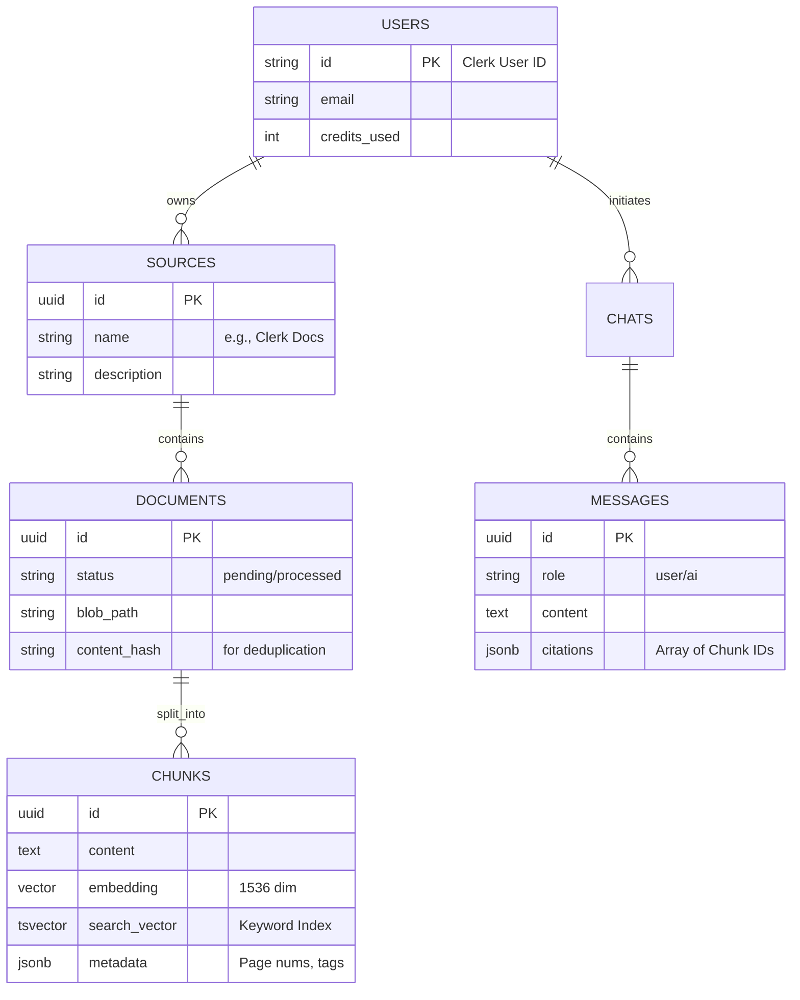

Yes, we are finished with the conceptual design and logic for the database. We have defined the entities, relationships, and specific features needed for Production RAG (Hybrid Search, RLS, Traceability).

Here is the comprehensive **Database Design Report**. You should save this as `database-schema.md` or similar in your project planning folder.

---

# 🗄️ Database Design Report: Project "Integration Forge"

**Version:** 2.0
**Date:** January 18, 2026 (Updated with Advanced Features)
**Target System:** PostgreSQL 16+ (Supabase)
**Extensions Required:** `vector` (pgvector), `uuid-ossp`

---

## 1. Executive Summary

This database is designed to support a **Multi-Tenant, Event-Driven RAG Application**. It prioritizes:

1.  **Security:** Strict Row-Level Security (RLS) enforcement based on User IDs.
2.  **Hybrid Retrieval:** Native support for both Semantic Search (Vectors) and Keyword Search (BM25/TSVector).
3.  **Traceability:** Full lineage from a Chat Message back to the specific Document Chunk used to generate it.

---

## 2. Entity-Relationship Diagram (ERD)

The system follows a strict hierarchy for Data Management (`Source` -> `Document` -> `Chunk`) and a separate flow for User Interaction (`Chat` -> `Message`).



---

## 3. Detailed Table Specifications

### A. Table: `users`

_Local mirror of Clerk authentication data._
| Column | Type | Constraints | Description |
| :--- | :--- | :--- | :--- |
| **id** | `TEXT` | **PK** | The exact User ID string from Clerk (e.g., `user_2b...`). |
| `email` | `TEXT` | `NOT NULL` | User email for notifications/matching. |
| `created_at` | `TIMESTAMPTZ` | `DEFAULT NOW()` | Account creation timestamp. |
| `credits_used` | `INTEGER` | `DEFAULT 0` | Tracks API usage for rate limiting/billing. |
| `storage_bytes_used`| `BIGINT` | `DEFAULT 0` | Total storage used by user (for 100MB limit enforcement). |
| `documents_count`| `INTEGER` | `DEFAULT 0` | Number of documents uploaded (for 50 doc limit). |
| `last_quota_reset`| `TIMESTAMPTZ` | `DEFAULT NOW()` | When the monthly quota was last reset. |

### B. Table: `sources`

_Logical containers for documents (like folders)._
| Column | Type | Constraints | Description |
| :--- | :--- | :--- | :--- |
| **id** | `UUID` | **PK**, `DEFAULT gen_random_uuid()` | Unique Source ID. |
| `user_id` | `TEXT` | **FK** (`users.id`) | Owner of this source. |
| `name` | `TEXT` | `NOT NULL` | Display name (e.g., "Prisma Documentation"). |
| `description`| `TEXT` | `NULLABLE` | Context for the Agent (e.g., "Use for DB queries"). |
| `created_at` | `TIMESTAMPTZ` | `DEFAULT NOW()` | |

### C. Table: `documents`

_Represents a raw file (PDF/Markdown) stored in Blob Storage._
| Column | Type | Constraints | Description |
| :--- | :--- | :--- | :--- |
| **id** | `UUID` | **PK**, `DEFAULT gen_random_uuid()` | Unique Document ID. |
| `source_id` | `UUID` | **FK** (`sources.id`) | Parent source. |
| `user_id` | `TEXT` | **FK** (`users.id`) | **Denormalized** for fast RLS checks. |
| `title` | `TEXT` | `NOT NULL` | Filename or header title. |
| `blob_path` | `TEXT` | `NOT NULL` | Path in Supabase Storage (e.g., `uid/docs/file.md`). |
| `token_count`| `INTEGER` | `DEFAULT 0` | Total tokens (for cost calculation). |
| `hash` | `TEXT` | `NULLABLE` | SHA256 hash of content to prevent duplicate uploads. |
| `status` | `ENUM` | `pending`, `processing`, `completed`, `failed` | Async processing state. |

### D. Table: `document_chunks` (The Vector Store)

_The critical table for RAG. Stores the split text and embeddings._
| Column | Type | Constraints | Description |
| :--- | :--- | :--- | :--- |
| **id** | `UUID` | **PK**, `DEFAULT gen_random_uuid()` | Unique Chunk ID. |
| `document_id`| `UUID` | **FK** (`documents.id`) | Parent document. |
| `user_id` | `TEXT` | **FK** (`users.id`) | **Denormalized** for fast RLS checks. |
| `chunk_index`| `INTEGER` | `NOT NULL` | The order of the chunk (0, 1, 2) for context reconstruction. |
| `content` | `TEXT` | `NOT NULL` | The actual text snippet. |
| `metadata` | `JSONB` | `DEFAULT {}` | Structured data (e.g., `{"header": "Auth", "page": 2, "language": "typescript"}`). |
| **`embedding`**| `VECTOR(1536)`| `NULLABLE` | OpenAI `text-embedding-3-small` vector. |
| **`search_vector`**| `TSVECTOR`| `NULLABLE` | PostgreSQL Full Text Search vector (for BM25). |
| **`parent_chunk_id`**| `UUID` | **FK** (`document_chunks.id`), `NULLABLE` | For parent-child indexing (small-to-big retrieval). |
| `chunk_type` | `TEXT` | `CHECK (chunk_type IN ('parent', 'child'))`, `DEFAULT 'parent'` | Distinguishes parent chunks (context) from child chunks (searchable). |
| `semantic_density`| `FLOAT` | `NULLABLE` | Semantic information density score (for ranking). |
| `context_prefix`| `TEXT` | `NULLABLE` | Contextual enrichment prepended before embedding (e.g., "[Doc: Clerk | Section: Auth]"). |
| `created_at` | `TIMESTAMPTZ` | `DEFAULT NOW()` | When the chunk was created. |

### E. Table: `chats`

_A conversation session._
| Column | Type | Constraints | Description |
| :--- | :--- | :--- | :--- |
| **id** | `UUID` | **PK**, `DEFAULT gen_random_uuid()` | Unique Chat ID. |
| `user_id` | `TEXT` | **FK** (`users.id`) | Owner. |
| `title` | `TEXT` | `NULLABLE` | Auto-generated title (e.g., "Clerk Integration Help"). |
| `created_at` | `TIMESTAMPTZ` | `DEFAULT NOW()` | |
| `updated_at` | `TIMESTAMPTZ` | `DEFAULT NOW()` | Used for sorting "Recent Chats". |

### F. Table: `messages`

_Individual text bubbles in a chat._
| Column | Type | Constraints | Description |
| :--- | :--- | :--- | :--- |
| **id** | `UUID` | **PK**, `DEFAULT gen_random_uuid()` | Unique Message ID. |
| `chat_id` | `UUID` | **FK** (`chats.id`) | Parent chat. |
| `role` | `ENUM` | `user`, `assistant` | Who sent the message. |
| `content` | `TEXT` | `NOT NULL` | The markdown text response. |
| `sources` | `JSONB` | `DEFAULT []` | Array of cited chunks. Example: `[{"chunk_id": "...", "score": 0.89}]`. |

---

## 4. Indexing Strategy (Performance Engineering)

We will apply these specific indexes to ensure queries run in <100ms.

1.  **HNSW Index (Vector Search):**
    - **Target:** `document_chunks.embedding`
    - **Algorithm:** `hnsw` (Hierarchical Navigable Small World) with `cosine` distance.
    - **Purpose:** Enables fast nearest-neighbor search for semantic meaning.

2.  **GIN Index (Keyword Search):**
    - **Target:** `document_chunks.search_vector`
    - **Algorithm:** `GIN` (Generalized Inverted Index).
    - **Purpose:** Enables fast keyword/lexical matching.

3.  **Composite Indexes (Filtering):**
    - `document_chunks (user_id, document_id)`: To quickly retrieve all chunks for a specific file.
    - `document_chunks (parent_chunk_id)`: For parent-child relationship lookups.
    - `document_chunks (chunk_type, user_id)`: For filtering by chunk type (parent vs child).
    - `documents (source_id)`: To quickly list files in a source folder.
    - `documents (user_id, status)`: For querying user's documents by processing status.

---

## 5. Security Architecture (RLS)

We will not rely on the Backend API for data security. We will enforce it at the Database level using **PostgreSQL Row Level Security Policies**.

- **Policy Rule:** `auth.uid() = user_id`
- **Behavior:**
  - When the API executes `SELECT * FROM document_chunks`, Postgres automatically appends `WHERE user_id = 'current_user'`.
  - This ensures User A can **never** see User B's embeddings, even if the API code has a bug.

---

## 6. Implementation Notes for Backend

- **Deduplication:** Before inserting a document, calculate the SHA256 hash of the file. Query `SELECT id FROM documents WHERE hash = :new_hash AND user_id = :uid`. If it exists, abort the upload.
- **Hybrid Search Implementation:** The backend will run two queries (Vector + Keyword), normalize the scores, and combine them using **RRF (Reciprocal Rank Fusion)** before re-ranking with FlashRank.
- **Parent-Child Retrieval Strategy:**
  1. Search using small child chunks (precise matching).
  2. Retrieve parent chunks for LLM context (full context).
  3. Return both to frontend: child for citation, parent for generation.
- **Rate Limiting Enforcement:**
  - Check `storage_bytes_used < 104857600` (100MB) before file upload.
  - Check `documents_count < 50` before creating new document.
  - Check `credits_used < 1000000` before processing query.
  - Monthly cron job to reset `credits_used` and update `last_quota_reset`.
- **Cost Tracking:** Integrate with LangSmith for automatic token counting and cost calculation. Set `ls_model_name` and `ls_provider` metadata on all LLM calls.

---

## 7. Advanced Chunking Strategy

The system implements a **Multi-Stage Chunking Pipeline** for production-grade retrieval:

### **Phase 1: MVP (Baseline)**

- `RecursiveCharacterTextSplitter`: 1000 chars, 200 overlap
- Purpose: Prove end-to-end pipeline works

### **Phase 2: Semantic Chunking**

- `SemanticChunker`: Uses embedding similarity to find natural breakpoints
- Benefit: 30-40% improvement in retrieval accuracy (preserves semantic boundaries)

### **Phase 3: Parent-Child Indexing**

- **Small chunks** (child): Embedded and searchable (precise matching)
- **Large chunks** (parent): Retrieved for LLM context (full context)
- Database: `parent_chunk_id` foreign key relationship

### **Phase 4: Contextual Enrichment**

- Prepend document context before embedding:

  ```
  [Document: Clerk Auth Guide | Section: Webhooks | Framework: Next.js]

  To handle webhook events, create an API route at /api/webhooks...
  ```

- Benefit: 25-35% improvement in retrieval precision (Anthropic 2024 research)

### **Phase 5: Code-Aware Splitting**

- Detect code blocks via language markers
- Use `RecursiveCharacterTextSplitter.from_language()` for syntax-aware splitting
- Split by function/class boundaries instead of arbitrary characters
- Metadata: Track language, function names, imports

---

**Status:** Database Design is **Complete**.
**Next Phase:** Backend Implementation (FastAPI Setup).
