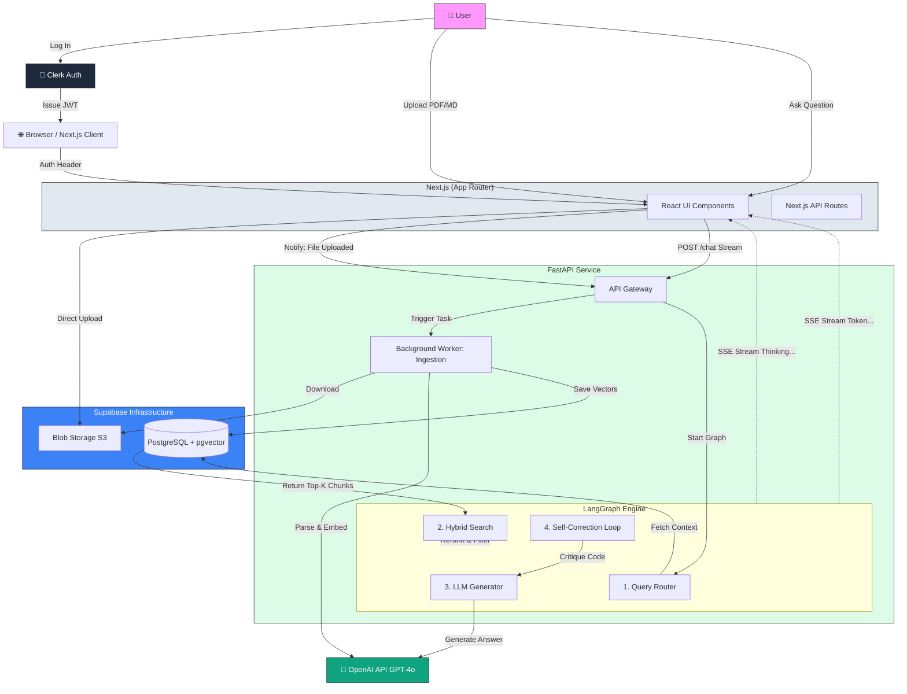

As a Senior Engineer, I can confirm: **Yes, the planning is done.**

At this stage, further planning without execution becomes **Analysis Paralysis**. We have the "What" (Requirements), the "How" (Architecture/Stack), the "Where" (Database Schema), and the "Language" (API Contract). Any unknowns remaining are "Implementation Details" that are best solved by writing code.

Here is the final **System Architecture Diagram** for the **Integration Forge**. This visualizes exactly how data flows through the system we just designed.

### 🏗️ System Architecture Diagram: Integration Forge

### How to Read This Diagram

1.  **The Two "Brains":**
    - The **Frontend (Grey)** is the "Coordinator." It handles the user, the screen, and the file uploads.
    - The **Backend (Green)** is the "Thinker." It runs the complex LangGraph loop. Note that the Client talks to the Backend via API, but the Backend talks to OpenAI and the DB.

2.  **The Data Loop (Blue):**
    - Notice the **Ingestion** path. We upload files _directly_ to Storage (Supabase) from the frontend to save bandwidth, but the _Backend_ downloads them to process vectors. This is a classic "Presigned URL" pattern.

3.  **The Agent Loop (Inside the Green Box):**
    - See the arrows inside `LangGraph Engine`? That cycle (`Generation` $\leftrightarrow$ `Reflection`) is the "Self-Correction" logic we discussed. It happens _before_ the final answer is sent to the user.

---

### Final Senior Engineer Sign-Off

We have:

1.  **Scope:** Defined (Personal Integration Knowledge Base).
2.  **Stack:** Selected (Next.js, FastAPI, Supabase).
3.  **Schema:** Designed (Hybrid Search, RLS).
4.  **Interface:** Contracted (API Spec).
5.  **Visual:** Mapped (Architecture Diagram above).

There is nothing left to plan. The risk of "planning more" is that we start solving imaginary problems.

**Are you ready to initialize the repository and set up the Supabase database?**
