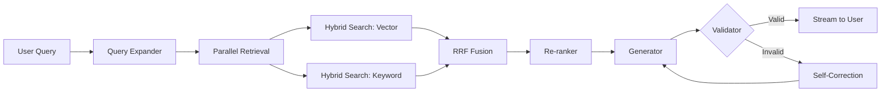

# 🎯 Final Technical Decisions: Project "Integration Forge"

**Version:** 2.0  
**Date:** January 18, 2026  
**Status:** ✅ **FINALIZED - Ready for Implementation**

---

## Executive Summary

This document consolidates all technical decisions made during the planning phase. These decisions are **locked** and will guide the implementation of the advanced agentic RAG system.

---

## 1. ✅ Re-ranking Strategy

### **Decision: Dual-Phase Re-ranking**

| Phase | Technology | Purpose | Status |
|-------|-----------|---------|--------|
| **MVP** | **FlashRank** | Open-source, free, local re-ranking | Start Here |
| **Production** | **Cohere Rerank** | Paid API, 10-15% better precision | Upgrade Later |

**Rationale:**
- FlashRank allows rapid prototyping without API costs
- Cohere provides comparison data for measuring ROI
- Learning both demonstrates understanding of trade-offs

**Implementation:**
```python
# Phase 1: MVP
from langchain_community.document_compressors import FlashrankRerank
compressor = FlashrankRerank()

# Phase 2: Production
from langchain.retrievers.document_compressors import CohereRerank
compressor = CohereRerank(model="rerank-english-v2.0")
```

---

## 2. ✅ Chunking Strategy

### **Decision: Multi-Stage Progressive Enhancement**

| Stage | Technology | Chunk Size | Purpose | Timeline |
|-------|-----------|------------|---------|----------|
| **MVP** | RecursiveCharacterTextSplitter | 1000 chars, 200 overlap | Baseline pipeline | Week 1-2 |
| **Advanced** | SemanticChunker | Variable (embedding-based) | Semantic boundaries | Week 3 |
| **Production** | Parent-Child Indexing | Small: 500 / Large: 2000 | Small-to-big retrieval | Week 4 |
| **Pro** | Contextual Enrichment | N/A | +35% precision (Anthropic) | Week 5 |
| **Expert** | Code-Aware Splitting | Function/class boundaries | Code documentation | Week 6 |

**Key Features:**
- ✅ Semantic boundary detection using embedding similarity
- ✅ Parent-child relationships in database (`parent_chunk_id` FK)
- ✅ Context prefix injection before embedding
- ✅ Language-specific code splitters (Python, TypeScript, JavaScript)
- ✅ Metadata enrichment (headers, language, functions, imports)

**Database Schema Additions:**
```sql
ALTER TABLE document_chunks ADD COLUMN
    parent_chunk_id UUID REFERENCES document_chunks(id),
    chunk_type TEXT CHECK (chunk_type IN ('parent', 'child')),
    semantic_density FLOAT,
    context_prefix TEXT;
```

---

## 3. ✅ Rate Limiting & Quotas

### **Decision: Multi-Tier User Limits**

| Limit Type | Value | Enforcement Point | Reset Frequency |
|------------|-------|-------------------|-----------------|
| **File Size** | 5 MB per file | Upload API | Per request |
| **Documents** | 50 documents | Document creation | Lifetime |
| **Storage** | 100 MB total | Upload API | Lifetime |
| **Tokens** | 1M tokens/month | Query API | Monthly cron |
| **Queries** | 100 queries/day | Chat API | Daily reset |

**Database Schema:**
```sql
ALTER TABLE users ADD COLUMN
    storage_bytes_used BIGINT DEFAULT 0,
    documents_count INTEGER DEFAULT 0,
    last_quota_reset TIMESTAMPTZ DEFAULT NOW();
```

**Cost Tracking:**
- Integration with **LangSmith** for automatic token counting
- Set `ls_model_name` and `ls_provider` on all LLM calls
- Dashboard for real-time cost monitoring

---

## 4. ✅ Query Expansion Strategy

### **Decision: LLM-Based Query Decomposition**

**Approach:** Use LLM to break complex multi-source queries into sub-queries

**Example:**
```python
# Input: "Integrate Clerk webhooks with Prisma"

# LLM Output:
[
    {
        "query": "Clerk webhook payload structure",
        "filters": {"tag": "clerk"},
        "priority": "high"
    },
    {
        "query": "Prisma create user syntax", 
        "filters": {"tag": "prisma"},
        "priority": "high"
    }
]

# Execute both in parallel, merge results
```

**Alternatives Considered:**
- ❌ **HyDE (Hypothetical Document Embeddings):** Too complex for MVP
- ❌ **Rule-based regex:** Not flexible enough
- ✅ **LLM decomposition:** Best balance of flexibility and control

**Implementation Timeline:** Week 7

---

## 5. ✅ Hybrid Search Architecture

### **Decision: RRF-Based Fusion**

**Components:**

1. **Dense Search (Semantic):**
   - Technology: `pgvector` with HNSW index
   - Embedding: `text-embedding-3-small` (1536 dimensions)
   - Distance: Cosine similarity
   - Top-K: 50 results

2. **Sparse Search (Keyword):**
   - Technology: PostgreSQL `tsvector` with GIN index
   - Algorithm: BM25-like scoring via `ts_rank_cd`
   - Top-K: 50 results

3. **Fusion:**
   - Algorithm: **Reciprocal Rank Fusion (RRF)**
   - Formula: $Score = \frac{1}{k + Rank_{vector}} + \frac{1}{k + Rank_{keyword}}$
   - Constant k: 60 (industry standard)
   - Final Top-K: 20 results

4. **Re-ranking:**
   - Stage 1: FlashRank/Cohere on top-20
   - Final Top-K: 5 results to LLM

**SQL Implementation:**
```sql
-- Dense Search
WITH vector_results AS (
    SELECT id, embedding <=> :query_vector AS distance
    FROM document_chunks
    WHERE user_id = :user_id
    ORDER BY distance LIMIT 50
),
-- Sparse Search
keyword_results AS (
    SELECT id, ts_rank_cd(search_vector, to_tsquery(:query)) AS rank
    FROM document_chunks
    WHERE search_vector @@ to_tsquery(:query)
    AND user_id = :user_id
    ORDER BY rank DESC LIMIT 50
)
-- RRF Fusion (done in Python)
```

---

## 6. ✅ Technology Stack (Finalized)

### **Frontend**
- **Framework:** Next.js 14+ (App Router)
- **Styling:** Tailwind CSS + Shadcn/UI
- **Auth:** Clerk (JWT token handoff to backend)
- **Streaming:** Vercel AI SDK for SSE

### **Backend**
- **Framework:** FastAPI (Python 3.11+)
- **Orchestration:** LangGraph (agentic loops)
- **Observability:** LangSmith (tracing, cost tracking)

### **Database**
- **Primary:** Supabase (PostgreSQL 16+)
- **Extensions:** `pgvector`, `uuid-ossp`
- **Vector Search:** pgvector with HNSW index
- **Keyword Search:** PostgreSQL `tsvector` with GIN index

### **Storage**
- **Blob Storage:** Supabase Storage (S3-compatible)

### **AI/ML**
- **LLM:** GPT-4o (reasoning/coding)
- **Embeddings:** text-embedding-3-small (1536 dim)
- **Re-ranking:** FlashRank → Cohere Rerank

### **Deployment**
- **Frontend:** Vercel (edge, streaming)
- **Backend:** Railway (Docker, long-running processes)

---

## 7. ✅ Agentic Workflow (LangGraph)

### **Decision: Self-Correcting Loop with Query Expansion**

**Graph Nodes:**



**Node Descriptions:**

1. **Query Expander:** Decomposes complex queries into sub-queries
2. **Parallel Retrieval:** Executes multiple searches concurrently
3. **Hybrid Search:** Dense (vector) + Sparse (keyword) in parallel
4. **RRF Fusion:** Combines results using Reciprocal Rank Fusion
5. **Re-ranker:** FlashRank/Cohere precision re-ranking
6. **Generator:** GPT-4o generates code/answer
7. **Validator:** Checks imports, syntax, hallucinations
8. **Self-Correction:** Rewrites with error context (max 3 retries)

**State Management:**
```python
class AgentState(TypedDict):
    query: str
    sub_queries: List[Dict]
    retrieved_chunks: List[Document]
    generated_code: str
    validation_errors: List[str]
    retry_count: int
    final_answer: str
```

---

## 8. ✅ Security Architecture

### **Decision: Database-Level RLS + API Token Validation**

**Authentication Flow:**
1. User logs in via Clerk (Next.js frontend)
2. Clerk issues JWT token
3. Frontend sends token in `Authorization: Bearer <jwt>` header
4. FastAPI validates token via Clerk JWKS endpoint
5. FastAPI extracts `user_id` from token

**Row-Level Security (RLS):**
```sql
-- Enable RLS
ALTER TABLE document_chunks ENABLE ROW LEVEL SECURITY;

-- Policy: Users can only see their own chunks
CREATE POLICY user_isolation ON document_chunks
    FOR ALL
    USING (user_id = current_setting('app.current_user_id')::TEXT);
```

**Enforcement:**
- Backend sets PostgreSQL session variable before queries
- Even if API has bugs, database enforces isolation
- Zero-trust architecture

---

## 9. ✅ Success Metrics & KPIs

### **Quantitative Metrics:**

| Metric | Baseline (MVP) | Target (Advanced) | Measurement Tool |
|--------|----------------|-------------------|------------------|
| Retrieval Precision@5 | 60-70% | 85-95% | Human evaluation |
| Chunk Quality | 50% semantic | 90% semantic | Manual review |
| Query Latency (P95) | <5s | <3s | LangSmith |
| Cost per Query | $0.05 | $0.03 | LangSmith |
| Code Block Intact | 60% | 95% | Syntax validator |

### **Qualitative Metrics:**
- ✅ Can handle "Clerk + Prisma" cross-source queries
- ✅ Generates working code with correct imports
- ✅ Cites specific chunks for each answer
- ✅ Handles code blocks >200 lines without breaking

---

## 10. ✅ Implementation Timeline

### **8-Week Roadmap**

| Week | Focus | Deliverables |
|------|-------|-------------|
| **1-2** | MVP Pipeline | RecursiveCharacterTextSplitter, basic hybrid search, FlashRank |
| **3** | Semantic Chunking | SemanticChunker, A/B testing |
| **4** | Parent-Child | Database migration, small-to-big retrieval |
| **5** | Contextual Enrichment | Context prefix, embedding A/B test |
| **6** | Code-Aware | Language splitters, code metadata |
| **7** | Query Expansion | LLM decomposition, parallel execution |
| **8** | Production Polish | Cohere upgrade, RLS, cost tracking |

---

## 11. ✅ Open Questions (Resolved)

| Question | Decision | Rationale |
|----------|----------|-----------|
| Re-ranker choice? | FlashRank → Cohere | Learn both, compare results |
| Chunking strategy? | Multi-stage progressive | Show expertise progression |
| Rate limits? | 5MB, 50 docs, 1M tokens/mo | Balance usability + cost |
| Query expansion? | LLM-based decomposition | Flexible, controllable |
| Parent-child? | ✅ Implement | Industry best practice |
| Code splitting? | Language-specific + overlap | Production-grade handling |

---

## 📋 Pre-Implementation Checklist

Before writing code, ensure:

- ✅ All 7 planning documents reviewed and approved
- ✅ Database schema finalized (with advanced columns)
- ✅ API contract defined (see `06_API_Contract.md`)
- ✅ Tech stack dependencies listed
- ✅ Supabase project ready to create
- ✅ Clerk account for auth
- ✅ OpenAI API key for embeddings/LLM
- ✅ LangSmith account for observability

---

## 🚀 Next Steps

1. **Initialize Supabase Project**
   - Create database
   - Enable `pgvector` extension
   - Run schema migrations

2. **Setup FastAPI Backend**
   - Project structure
   - Auth middleware
   - Health check endpoint

3. **Implement MVP Chunking Pipeline**
   - RecursiveCharacterTextSplitter
   - Basic embedding
   - Database insert

4. **Build Hybrid Search**
   - pgvector HNSW index
   - tsvector GIN index
   - RRF fusion logic

5. **Create LangGraph Agent**
   - State definition
   - Node implementations
   - Self-correction loop

---

**Status:** All technical decisions are **FINALIZED**.  
**Ready for:** Phase 2 - Implementation  
**Approved by:** Planning AI + Surya (January 18, 2026)

---

## Appendix: Key Learning Outcomes

By completing this project, you will demonstrate mastery of:

1. ✅ **Advanced RAG Patterns** (semantic chunking, parent-child, contextual enrichment)
2. ✅ **Production Database Design** (RLS, hybrid indexing, foreign keys)
3. ✅ **Agentic Orchestration** (LangGraph state machines, self-correction)
4. ✅ **Cost Optimization** (rate limiting, token tracking, efficient chunking)
5. ✅ **Information Retrieval** (RRF, re-ranking, query expansion)
6. ✅ **Modern Full-Stack** (Next.js, FastAPI, Supabase, Clerk)
7. ✅ **Code Quality** (type safety, error handling, observability)
8. ✅ **System Design** (multi-tenancy, security, scalability)

This portfolio project will position you as a **Senior AI Engineer** who can build production-grade RAG systems.
